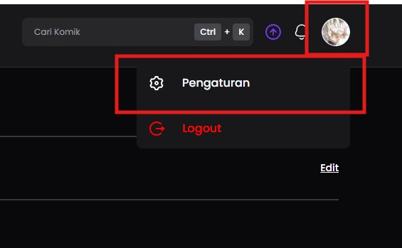
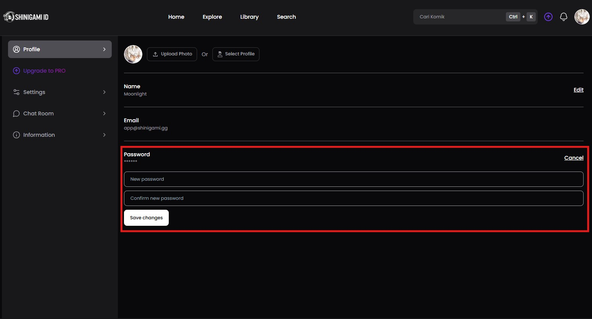

# Mengatur Password

#### Syarat:

1. ✅ Sudah **Login** pakai **Social Login** atau **Email & Password**.&#x20;
2. ✅ Kalau kamu **Login** pakai **Social Login**, kamu bisa atur **Password** di sini supaya bisa **Login** pakai **Email & Password** juga.

#### Langkah 1: Buka Pengaturan

1. Klik foto profil kamu di pojok kanan atas.
2. Pilih **Pengaturan (Settings)** dari menu dropdown.

<figure><figcaption></figcaption></figure>

#### Langkah 2: Ubah Password

1. Buka Tab **Profile**
2. Masukkan **password baru**.
3. Klik **Save Changes** buat memperbarui **Password** kamu.

<figure><figcaption></figcaption></figure>

#### Langkah 4: Selamat Kamu sudah berhasil membuat atau memperbarui password.
