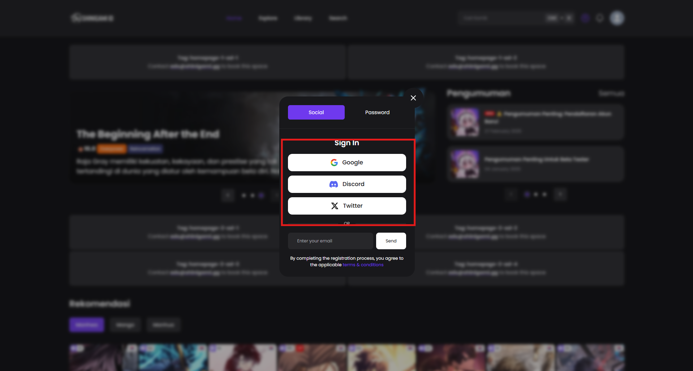

# Login Dengan Social

#### Syarat:

✅ Akun **Social Media** kamu harus sudah ada dan **logged in** di browser yang digunakan.

<figure><figcaption></figcaption></figure>

#### Langkah 1: Buka Halaman Login

1. Klik tombol **Login** di pojok kanan atas situs.
2. Akan muncul pop-up dengan pilihan **Login**.

#### Langkah 2: Pilih Metode Social Login

1. Klik **Google**, **Discord**, atau **Twitter** buat **Login** pakai akun tersebut.
2. Ikuti proses otentikasi di platform yang dipilih.
3. Setelah selesai, kamu bakal diarahkan kembali ke situs dan langsung **Login**.
