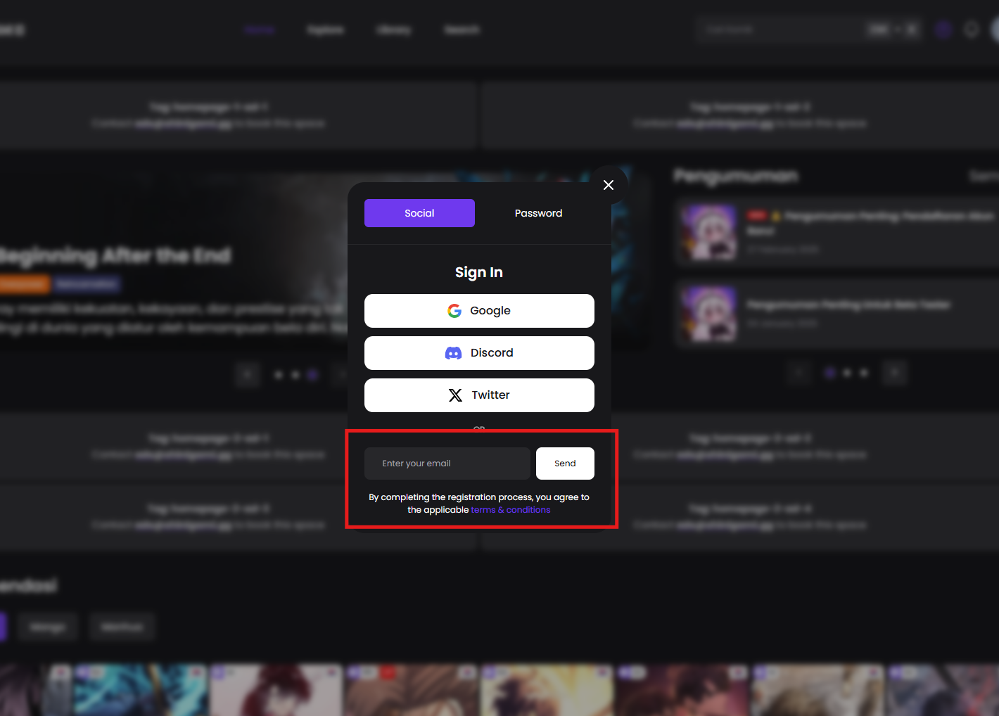
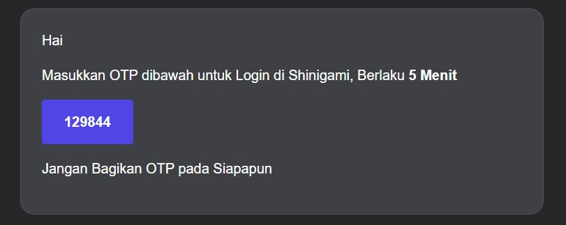
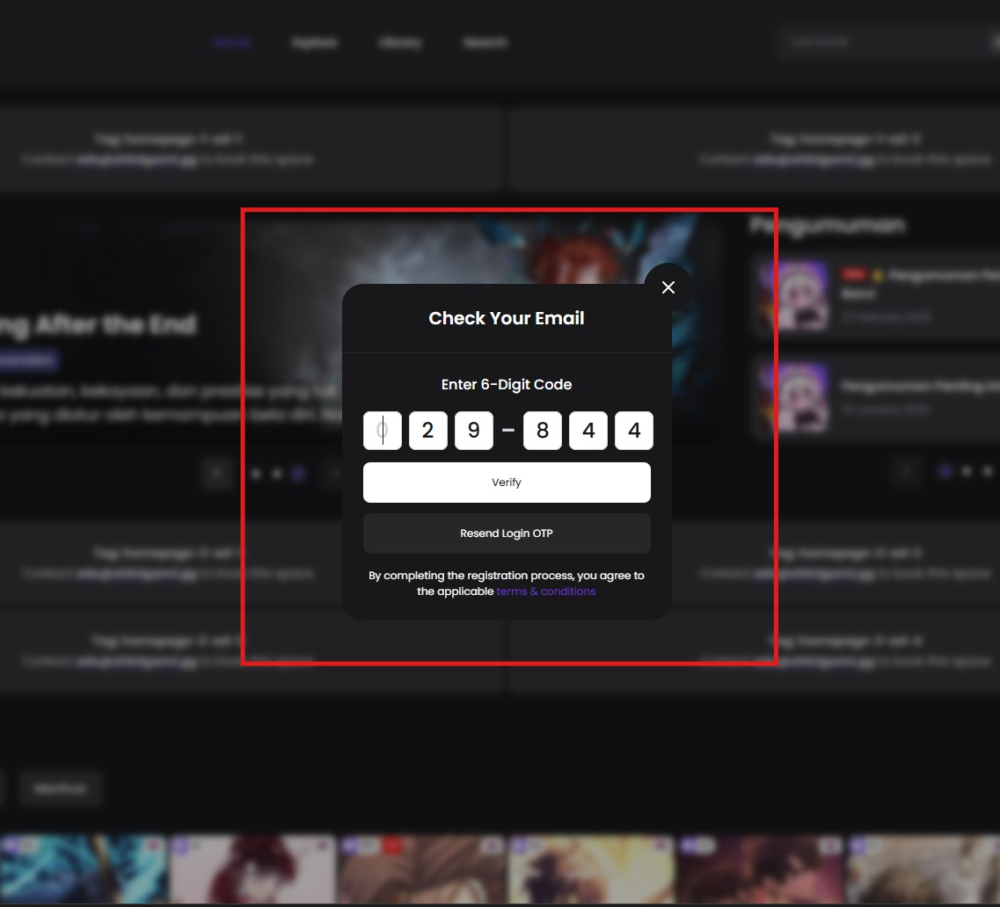

# Login dengan Email OTP

#### Syarat:

✅ Kamu sudah **Login** pakai **Social Media** dengan **email yang sama**, atau sudah **Register** dan **konfirmasi email**.

#### Langkah 1: Masukkan Email Kamu

1. Di halaman **Login**, pilih opsi **Email Login**.
2. Masukkan email kamu di kolom yang tersedia.
3. Klik **Send** buat menerima **One-Time Password (OTP)** lewat email.

<figure><figcaption></figcaption></figure>

#### Langkah 2: Cek Email Kamu

1. Buka inbox email dan cari email dari **Shinigami ID (auth@shngm.io)** .
2. Kamu bakal dapet **6-digit OTP**.
3. Salin kode **OTP** tersebut.

<figure><figcaption></figcaption></figure>

#### Langkah 3: Masukkan OTP

1. Balik lagi ke situs.
2. Masukkan **6-digit OTP** yang kamu terima.
3. Klik **Verify** buat menyelesaikan proses **Login**.

<figure><figcaption></figcaption></figure>

#### Langkah 4: Berhasil Login

Kalau **OTP** yang dimasukkan benar, kamu bakal **Login** ke akun kamu.
