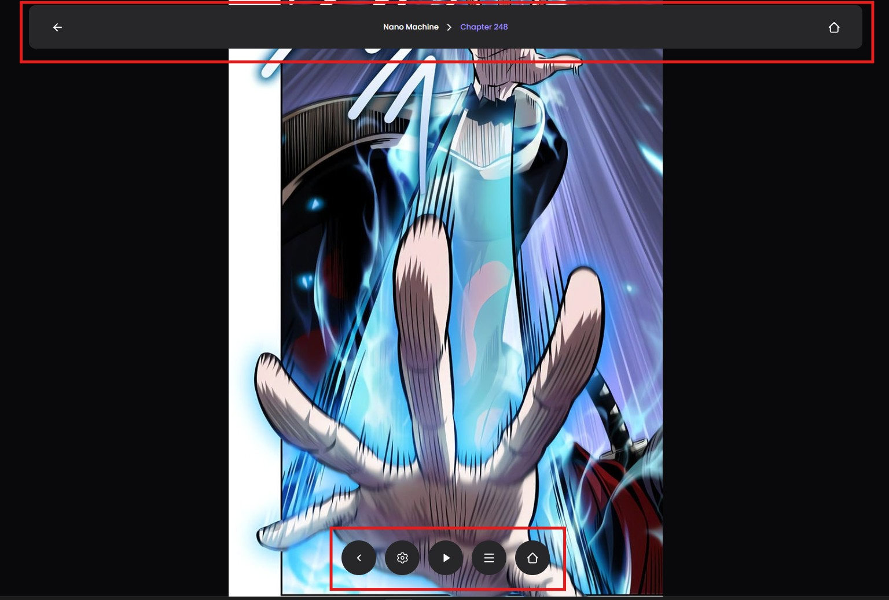
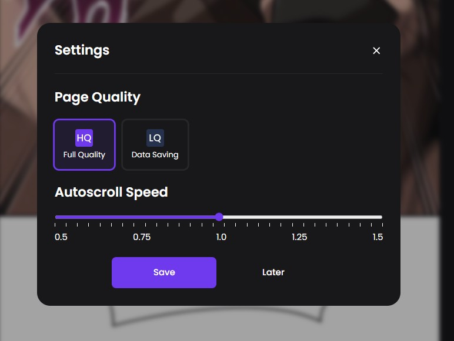
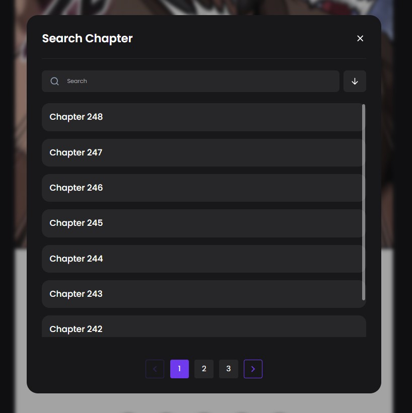
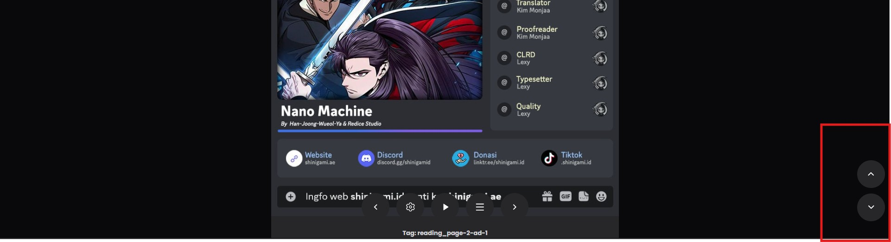
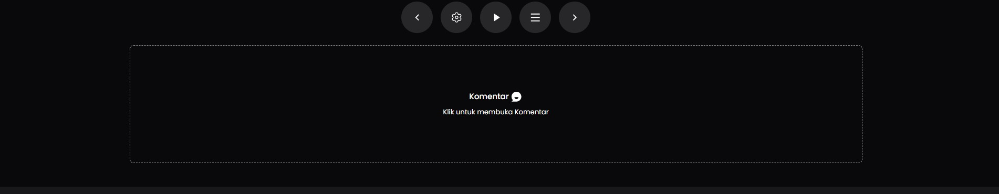

# Reading Page

Halaman membaca di **Shinigami ID** memiliki tampilan yang simpel dan bisa dikontrol dengan mudah.

<figure><figcaption></figcaption></figure>


HARAP BACA! KALIAN BISA MENYEMBUNYIKAN BAGIAN YANG DITANDAI DENGAN KOTAK MERAH DENGAN MENGKLIK ATAU MENUSUK GAMBAR KOMIKNYA.



HARAP BACA! KALIAN BISA MENYEMBUNYIKAN BAGIAN YANG DITANDAI DENGAN KOTAK MERAH DENGAN MENGKLIK ATAU MENUSUK GAMBAR KOMIKNYA.



HARAP BACA! KALIAN BISA MENYEMBUNYIKAN BAGIAN YANG DITANDAI DENGAN KOTAK MERAH DENGAN MENGKLIK ATAU MENUSUK GAMBAR KOMIKNYA.



HARAP BACA! KALIAN BISA MENYEMBUNYIKAN BAGIAN YANG DITANDAI DENGAN KOTAK MERAH DENGAN MENGKLIK ATAU MENUSUK GAMBAR KOMIKNYA.


### 1. Header (Bagian Atas)

Header di bagian atas menunjukkan **Judul Komik** dan **Chapter Saat Ini**.

* **Tombol Back** :arrow\_left: → Kembali ke halaman **Manga Detail**.
* **Tombol Home** :house: → Kembali ke **Homepage**

<figure><figcaption></figcaption></figure>

### 2. Navigasi di Bagian Bawah

Di bagian bawah terdapat beberapa tombol navigasi:

* **Tombol Back** :arrow\_left: → Ke **Chapter Sebelumnya**.
* **Tombol Pengaturan** :gear: → Membuka **Settings**.
* **Tombol List** :books: → Membuka **Chapter List**.
* **Tombol Home** :house: → Akan Muncul Jika **Chapter Selanjutnya** Tidak ada
* Tombol Next :track\_next: → Ke **Chapter Berikutnya**.

<figure><figcaption>
Ada Next Chapter
</figcaption></figure>

<figure><figcaption>
Tidak ada Next Chapter
</figcaption></figure>

### 3. Pengaturan (Settings)

Buka **Settings Modal** dengan menekan tombol **Gear** di navigasi bawah.

* **Page Quality** → Atur kualitas gambar. Pengaturan ini berpengaruh ke **penggunaan kuota**, bukan kecepatan loading.
* **Autoscroll Speed** → Sesuaikan **kecepatan autoscroll** sesuai preferensi kamu.

<figure><figcaption></figcaption></figure>

### 4. List Chapter

Buka **Chapter List** dengan menekan tombol **List**.

* **Cari chapter** yang ingin kamu baca.
* **List lengkap semua chapter** akan ditampilkan.

<figure><figcaption></figcaption></figure>

### 5. Tombol Scroll Up dan Down

Di sisi kanan layar terdapat tombol untuk **Scroll Up dan Scroll Down**:

* **Scroll Up (↑)** → Membawa kamu ke **paling atas** halaman.
* **Scroll Down (↓)** → Langsung **ke bagian komentar**.

<figure><figcaption></figcaption></figure>

### 6. Komentar

* Klik di **box komentar** untuk membuka bagian komentar dan berinteraksi dengan pembaca lain.

<figure><figcaption></figcaption></figure>

Sekarang kamu sudah tahu cara menggunakan halaman Reading di **Shinigami ID**! Selamat membaca! 📖🎉
