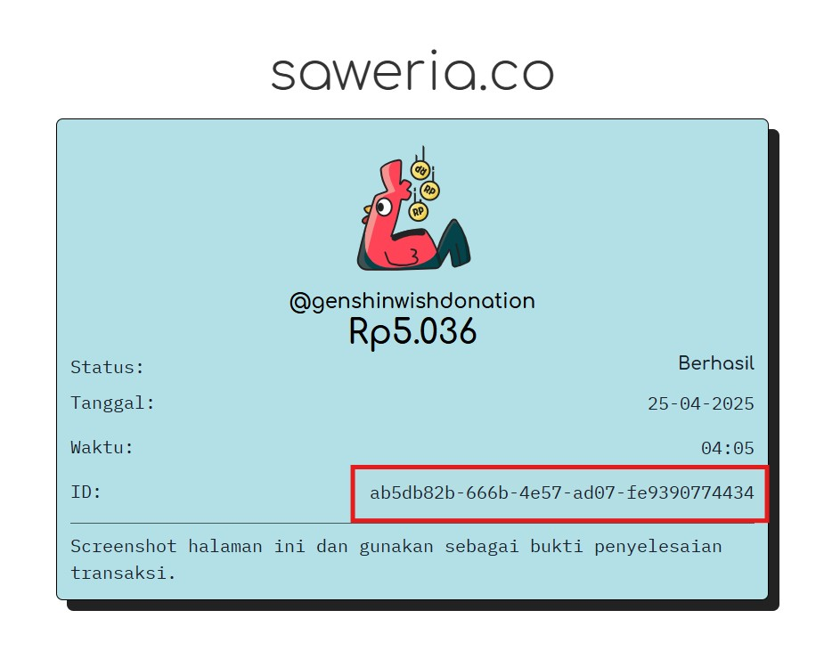

# Tutorial Klaim Premium Jika Tidak otomatis aktif

## Panduan Klaim Premium & Role Discord

### **Kapan perlu klaim manual?**

Jika kamu **login ke Saweria** saat berdonasi, Saweria **tidak mengirimkan alamat email ke sistem kami**. atau jika kamu memasukkan email yang salah, Shinigami bakal gagal mengaktifkan premium.\
Ikuti panduan ini untuk mengirim ulang data secara manual.

***

### 1 — Cari _Donation ID_ di Saweria

1. Buka e-mail dari Saweria _**atau**_ SS-an Bukti Transfer kamu

<figure><figcaption><p>Contoh ID Donasi dari Saweria</p></figcaption></figure>

<figure><figcaption><p>Contoh ID donasi dari Email saweria</p></figcaption></figure>

2. Cari kolom **“Donation ID”** (Contoh: `c1bbde3a-97dd-484b-947b-fc30784c3cee`)
3. Simpan ID tersebut, nanti kita kirimkan ke bot

***

### 2 — Aktifkan Premium lewat Bot

#### A. Via **Telegram**

1. DM Bot shinigami di [https://t.me/Dewakematianbot](https://t.me/Dewakematianbot)
2.  Ketik

    ```
    /claim
    ```

    > Bot akan:
    >
    > * meminta kamu memasukkan Donation ID
3. Masukkan _Donation ID_&#x20;
4. Masukkan email yang mau dipremiumkan.
5. Bot akan menjawab **✅ Klaim diterima!** — premium akan segera aktif


<figure><figcaption><p>Contoh Claim di Telegram</p></figcaption></figure>

***

#### B. Via **Discord**

Join Discord Shinigami [https://discord.gg/shinigamid](https://discord.gg/shinigamid)

```
/claim donation_id:<DonationID> email:<email>
```

Bot akan membalas:

```
✅ Claim received! Premium will be active soon.
```

> Jika gagal (ID salah / email salah / sudah pernah dipakai) bot akan memberi pesan ❌ dan alasannya.

<figure><figcaption><p>Contoh Command di Discord</p></figcaption></figure>

***

### 3 — Mengambil Role Discord Premium

Setelah premium **berhasil** (status transaksi `success`) kamu berhak dapat role premium di server Discord **Shinigami**.

1. Pastikan sudah join server: [https://discord.gg/shinigamid](https://discord.gg/shinigamid)
2. pergi ke channel #req-role-premium
3. Jalankan Command:&#x20;

```
/getrole email:<email>
```

atau bahasa Indo:

```
/dapatkan-role email:<email>
```

* **Email** harus sama persis dengan yang tercatat di platform Shinigami (bukan di Saweria!)
* Role **Premium** akan diberikan maksimal beberapa detik setelah perintah berhasil
* Role otomatis **expire** setelah 30 hari; kamu bisa beli lagi dan ulangi proses ini

<figure><figcaption><p>Contoh Command</p></figcaption></figure>

***

### 4 — Troubleshooting

| Kendala                               | Solusi                                                      |
| ------------------------------------- | ----------------------------------------------------------- |
| `❌ Donation ID tidak valid`           | Pastikan menyalin seluruh UUID (36 karakter, termasuk `-`). |
| `❌ Format email tidak valid`          | Cek salah ketik dan spasi.                                  |
| `already_claimed` / `already_success` | ID sudah pernah diklaim atau premium sudah aktif otomatis.  |
| Tidak dapat role walau premium aktif  | Jalankan `/dapatkan-role` lagi; pastikan email 100 % sama.  |
| Bot tidak membalas                    | Coba lagi beberapa menit; jika masih sama hubungi admin.    |

