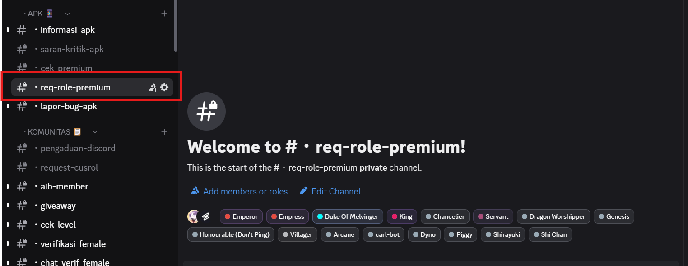

# Tutorial Mendapatkan Role Premium

### 📘 Panduan Penggunaan Bot Premium — _Shi Chan_

Bot ini digunakan untuk memverifikasi pembelian Anda dan memberikan **role premium** secara otomatis di server Discord.

***

#### 📌 Syarat Mendapatkan Role Premium

1. Kamu telah **melakukan pembelian Premium di Sociabuzz**
2. Email yang Kamu gunakan saat membeli **masih valid.**
3. Kamu Menjalankan Perintah BOT Sebelum Masa Tenggang 7 Hari.
4. Kamu **masih menjadi member** server Discord kami.

***

### 🔧 Cara Menggunakan

**1. Buka Channel Bot**

Masuk ke channel Discord  `#・req-role-premium`  Di Discord Server Shinigami 

Join Ke Server Shinigami --> [https://discord.gg/shinigamid](https://discord.gg/shinigamid)

<figure><figcaption></figcaption></figure>

***

**2. Jalankan Command`/dapatkan-role`**

Ketik perintah berikut:

```bash
/dapatkan-role email: <email_kamu>
```

Contoh:

```
/dapatkan-role email: john.doe@gmail.com
```

Lalu tekan `Enter` \


<figure><figcaption></figcaption></figure>

***

**3. Tunggu Hasil**

Bot akan mengecek apakah email kamu cocok dengan transaksi yang valid dalam 7 hari terakhir.

* ✅ Jika ditemukan:
  * kamu akan langsung diberikan **role "Premium Enjoyer"** selama 30 hari.
  * Bot akan mengirim pesan konfirmasi.
* ❌ Jika tidak ditemukan:
  * Bot akan memberitahukan bahwa tidak ada transaksi ditemukan.
  * Pastikan email kamu benar, dan pembelian dilakukan dalam waktu 7 hari terakhir.

***

#### 📅 Masa Aktif Role

* Role premium aktif selama **30 hari** sejak Anda menjalankan `/dapatkan-role`.
* Setelah 30 hari, role akan **dicabut otomatis oleh bot**.

***

#### ℹ️ Bantuan

Jika Kamu mengalami masalah saat menggunakan bot:

* Pastikan email Anda benar.
* Pastikan Kamu masih menjadi member server.
* Pastikan Kamu menjalankan perintah dalam 7 hari setelah pembelian.
* Jika tetap gagal, hubungi admin server untuk bantuan.

***

#### ❤️ Terima Kasih
